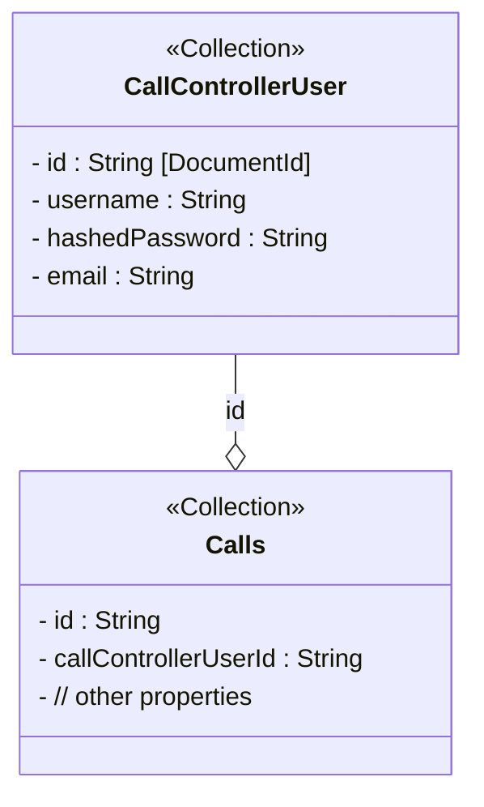

```mermaid
classDiagram
    class CallControllerUser {
    <<Collection>>
    - id : String [DocumentId]
    - username : String
    - hashedPassword : String
    - email : String
    }
    class Calls {
        <<Collection>>
        - id : String
        - callControllerUserId : String
        - // other properties
    }

    CallControllerUser --o Calls : id
```